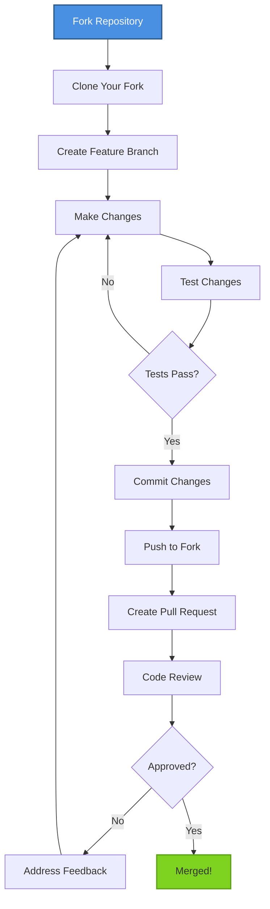
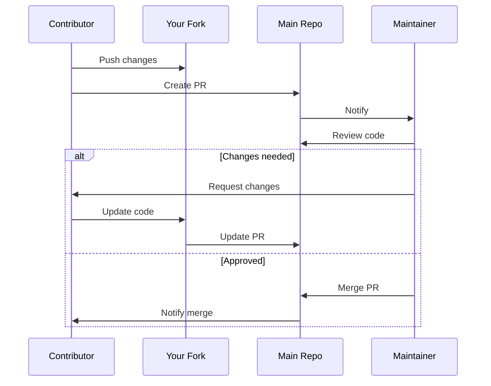
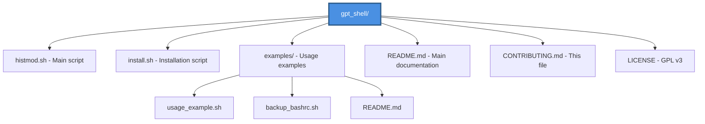

# Contributing to GPT Shell

Thank you for your interest in contributing to GPT Shell! This document provides guidelines and instructions for contributing.

## How to Contribute



## Getting Started

1. Fork the repository on GitHub
2. Clone your fork locally:
   ```bash
   git clone https://github.com/YOUR_USERNAME/gpt_shell.git
   cd gpt_shell
   ```

3. Create a new branch for your feature:
   ```bash
   git checkout -b feature/your-feature-name
   ```

## Development Guidelines

### Code Style

- Follow existing bash scripting conventions
- Use meaningful variable names
- Add comments for complex logic
- Keep functions small and focused

### Testing

Before submitting your changes:

1. Test the script on a clean system
2. Verify backup functionality works
3. Ensure error handling is robust
4. Check that changes don't break existing functionality

### Commit Messages

Follow conventional commit format:

```
type(scope): subject

body

footer
```

Types:
- `feat`: New feature
- `fix`: Bug fix
- `docs`: Documentation changes
- `style`: Code style changes (formatting, etc.)
- `refactor`: Code refactoring
- `test`: Adding tests
- `chore`: Maintenance tasks

Example:
```
feat(history): Add support for custom HISTSIZE values

Allow users to specify custom values for HISTSIZE and HISTFILESIZE
via command line arguments.

Closes #123
```

## Pull Request Process



1. Ensure your code follows the guidelines above
2. Update documentation if needed
3. Add your changes to the PR description
4. Link any related issues
5. Wait for review from maintainers

## Types of Contributions

### Bug Reports

Use the issue tracker to report bugs. Include:
- Description of the bug
- Steps to reproduce
- Expected behavior
- Actual behavior
- System information (OS, bash version)

### Feature Requests

We welcome feature suggestions! Please include:
- Clear description of the feature
- Use case and benefits
- Possible implementation approach

### Documentation

Improvements to documentation are always welcome:
- Fix typos or unclear explanations
- Add examples
- Improve diagrams
- Translate to other languages

### Code Contributions

Areas where contributions are especially welcome:
- Additional safety checks
- Support for other shells (zsh, fish)
- Enhanced backup strategies
- Better error messages
- Unit tests

## Project Structure



## Questions?

Feel free to open an issue with the `question` label if you need help or clarification.

## Code of Conduct

- Be respectful and inclusive
- Welcome newcomers
- Focus on constructive feedback
- Maintain a professional environment

## License

By contributing, you agree that your contributions will be licensed under the GNU General Public License v3.0.

---

Thank you for contributing to GPT Shell!
