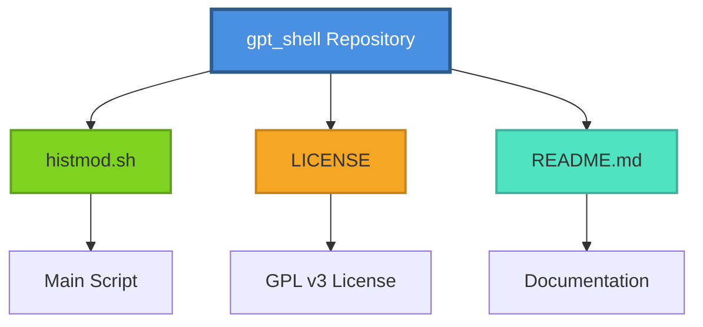
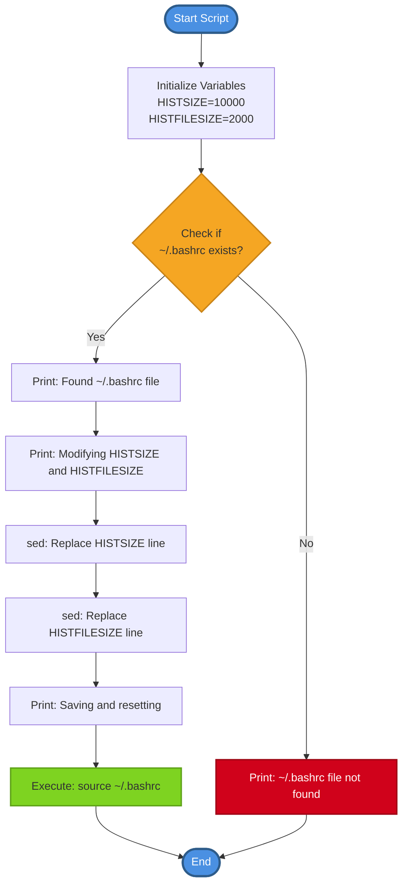
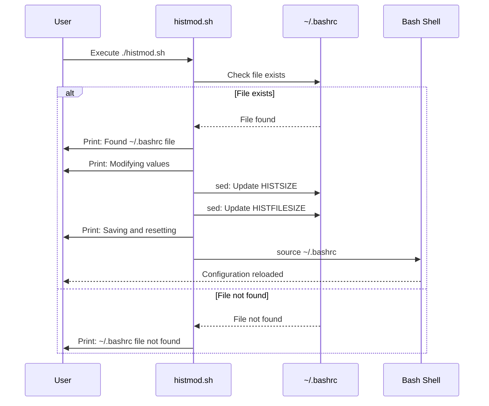
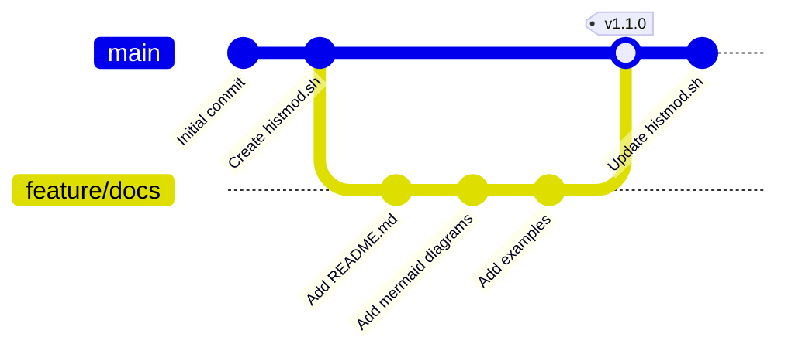
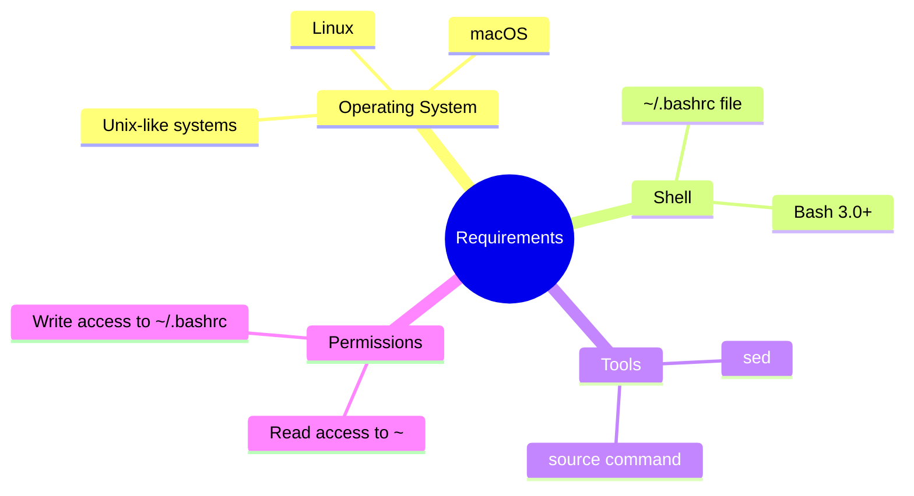
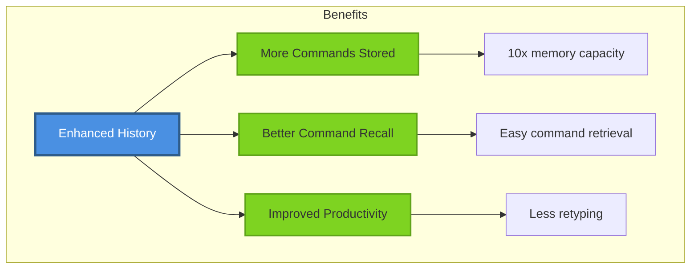
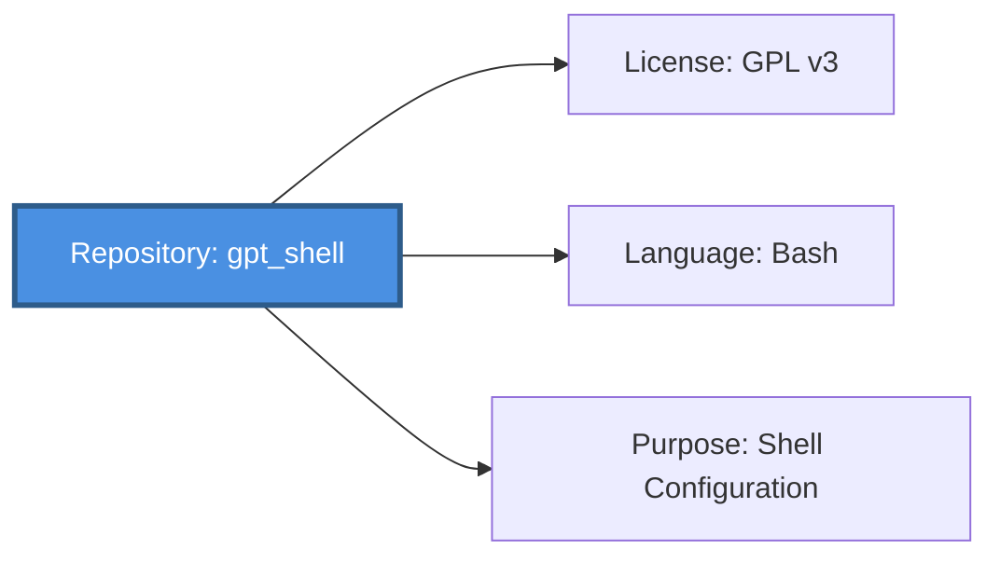

# GPT Shell - Bash History Modifier

A simple yet powerful bash utility that automatically configures your bash history settings for optimal command retention and shell productivity.

## Overview

This script locates and modifies your `~/.bashrc` file to enhance bash history settings, increasing both `HISTSIZE` (in-memory history) and `HISTFILESIZE` (on-disk history) to retain more command history.

## Features

- Automatically locates `~/.bashrc` configuration file
- Updates `HISTSIZE` to 10,000 commands
- Updates `HISTFILESIZE` to 2,000 lines
- Validates file existence before modification
- Automatically reloads bash configuration after changes
- Safe sed-based modifications

## Repository Structure



## Script Execution Flow



## Installation & Usage

### Quick Start

```bash
# Clone the repository
git clone https://github.com/danindiana/gpt_shell.git
cd gpt_shell

# Make the script executable
chmod +x histmod.sh

# Run the script
./histmod.sh
```

### Usage Diagram



## Git Workflow



## Configuration Details

### Before Script Execution
```bash
# Typical default values in ~/.bashrc
HISTSIZE=1000
HISTFILESIZE=2000
```

### After Script Execution
```bash
# Enhanced values set by histmod.sh
HISTSIZE=10000      # Stores 10,000 commands in memory
HISTFILESIZE=2000   # Maintains 2,000 lines in ~/.bash_history
```

## System Requirements



## How It Works

### Technical Flow


### Modification Pattern

The script uses `sed` with the following patterns:

```bash
sed -i "s/HISTSIZE.*/$HISTSIZE/g" ~/.bashrc
sed -i "s/HISTFILESIZE.*/$HISTFILESIZE/g" ~/.bashrc
```

This matches any line starting with `HISTSIZE` or `HISTFILESIZE` and replaces the entire line with the new value.

## Benefits



## Use Cases

1. **Developers**: Retain complex command sequences and build commands
2. **System Administrators**: Keep track of system maintenance commands
3. **DevOps Engineers**: Maintain history of deployment and configuration commands
4. **Power Users**: Enhanced command line productivity

## Safety Features

- File existence validation before modification
- Non-destructive sed replacements
- Automatic configuration reload
- Clear user feedback at each step

## Contributing

Contributions are welcome! Please feel free to submit a Pull Request.

## License

This project is licensed under the GNU General Public License v3.0 - see the [LICENSE](LICENSE) file for details.

## Repository Information



## Author

Created and maintained by the GPT Shell project contributors.

## Support

For issues, questions, or contributions, please visit the repository's issue tracker.

---

**Note**: Always backup your `~/.bashrc` file before running scripts that modify it. While this script is designed to be safe, it's good practice to maintain backups of your configuration files.
