# Architecture Documentation

## System Architecture

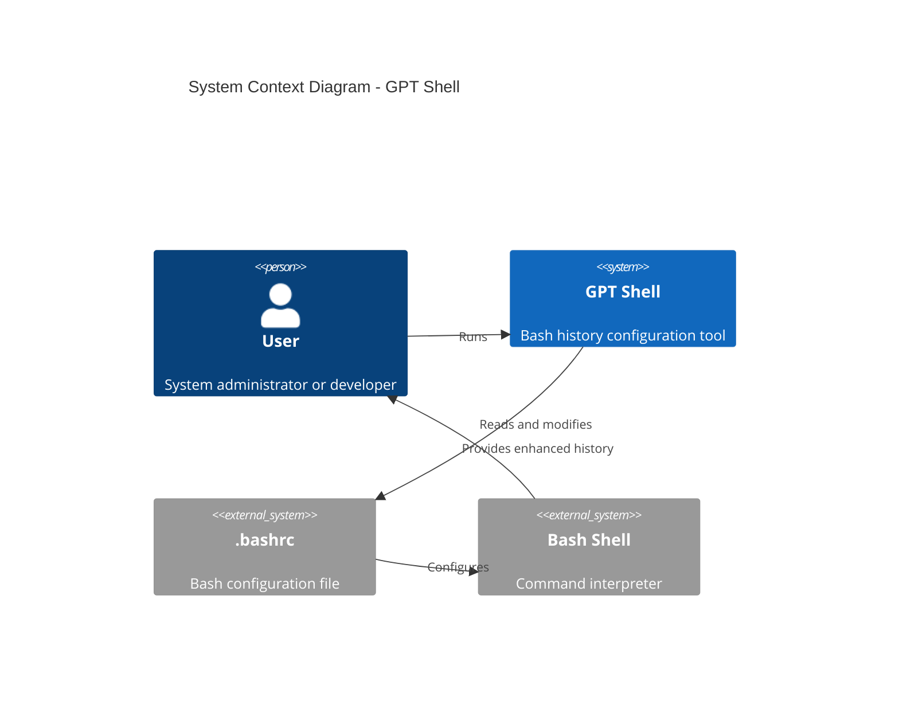

## Component Architecture

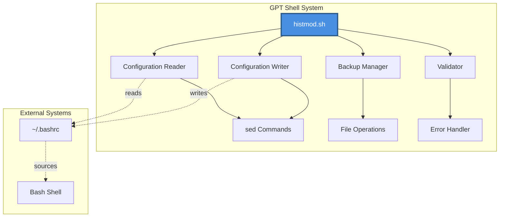

## Data Flow

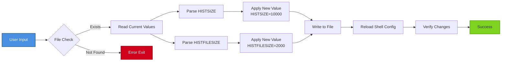

## Deployment Architecture

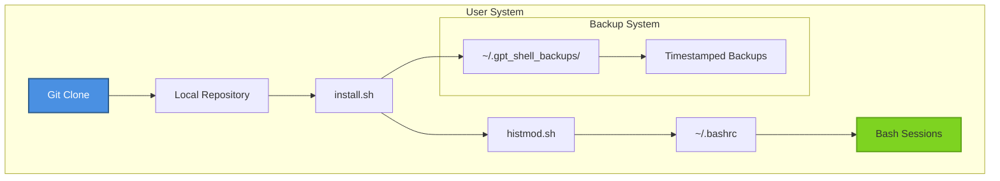

## State Machine

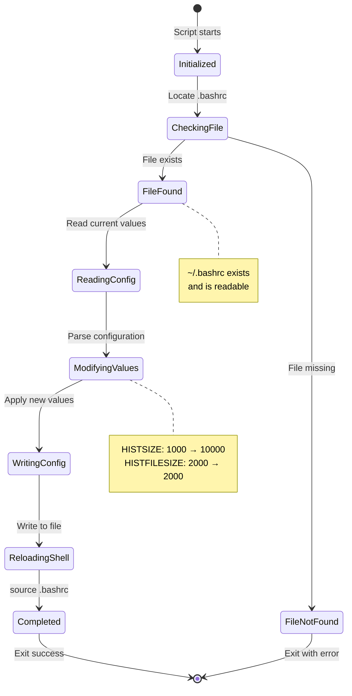

## Class Diagram (Conceptual)

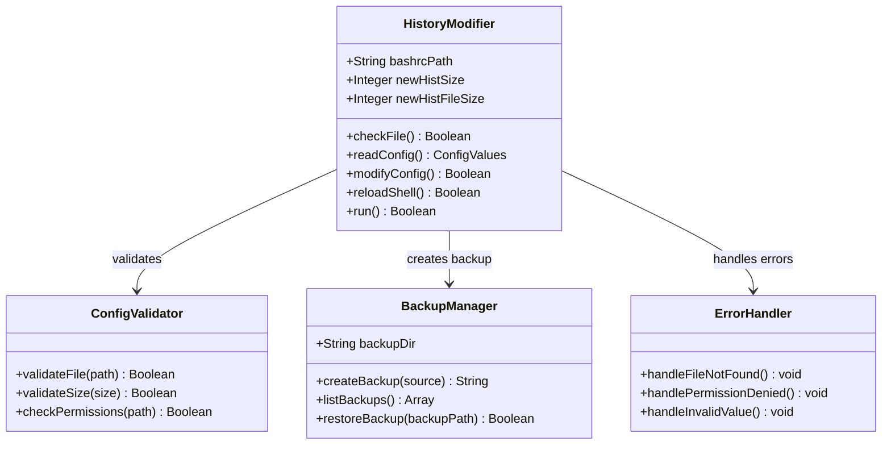

## Sequence Diagram - Full Flow

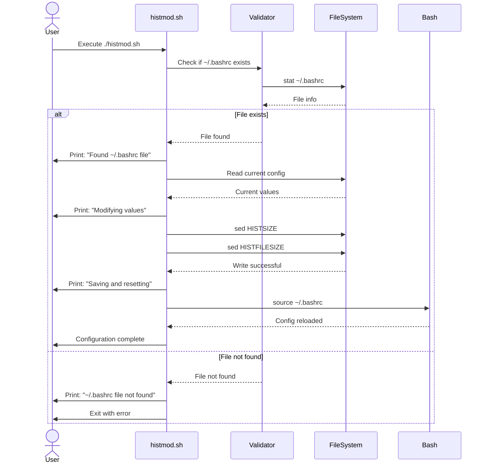

## Technology Stack

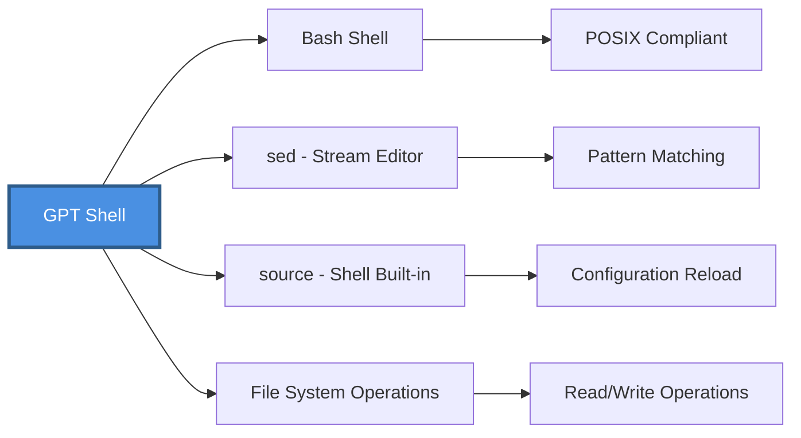

## Security Model

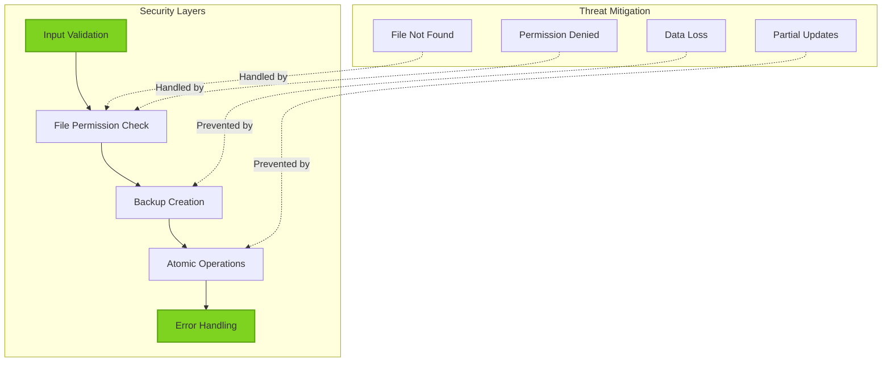

## Performance Characteristics

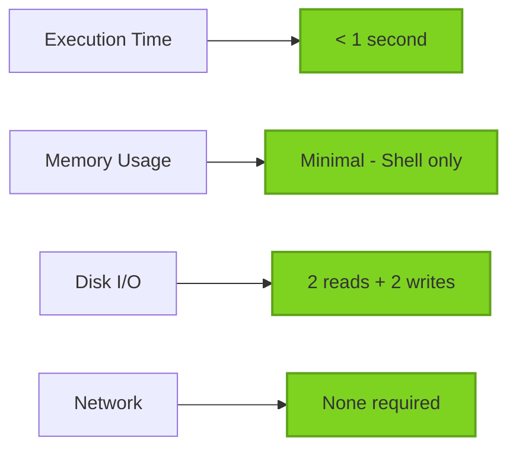

## Scalability

The system is designed for single-user, single-system deployment:

- No concurrent access issues
- No database requirements
- No network dependencies
- Minimal resource usage
- Instant execution

## Future Architecture Considerations

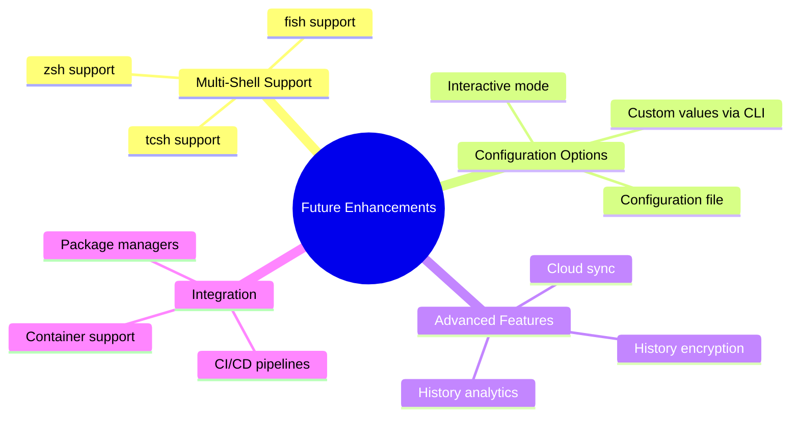
