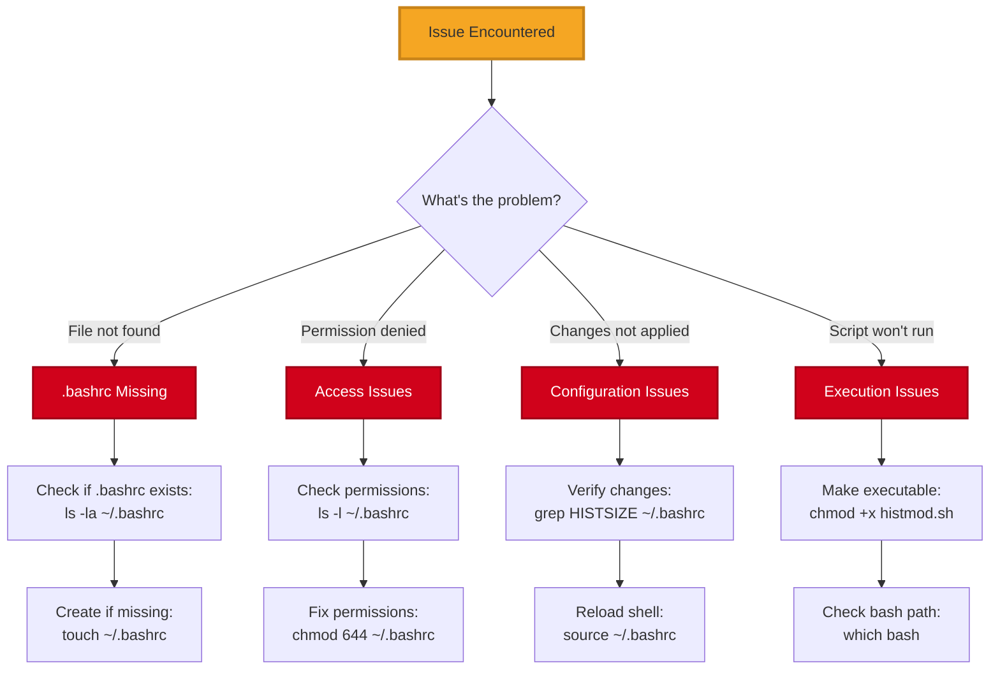
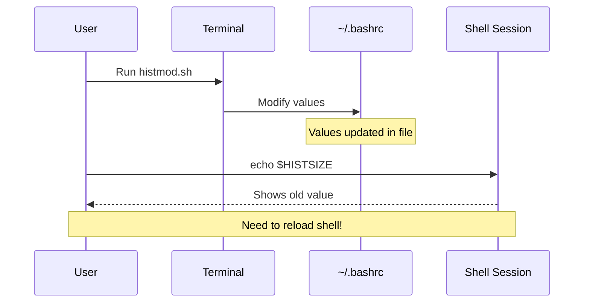
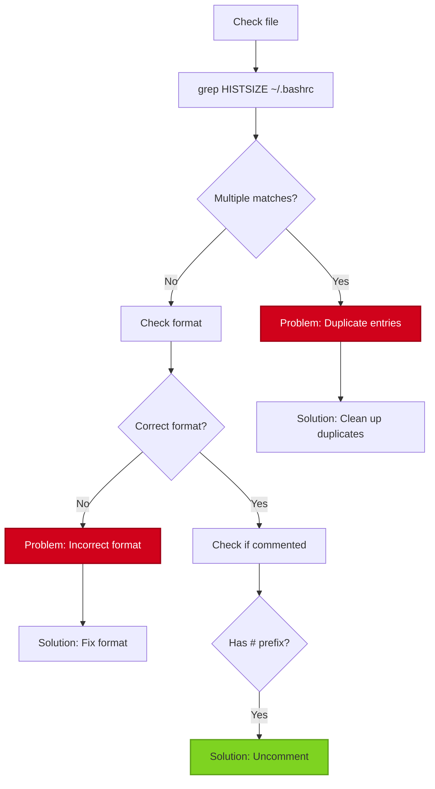
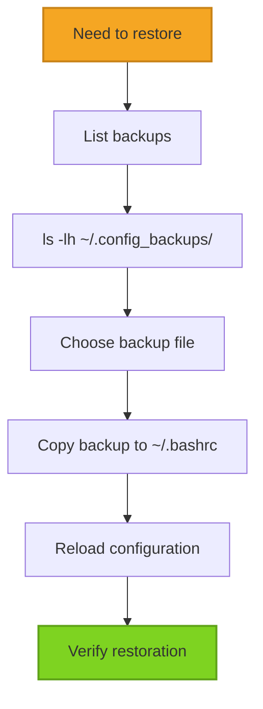
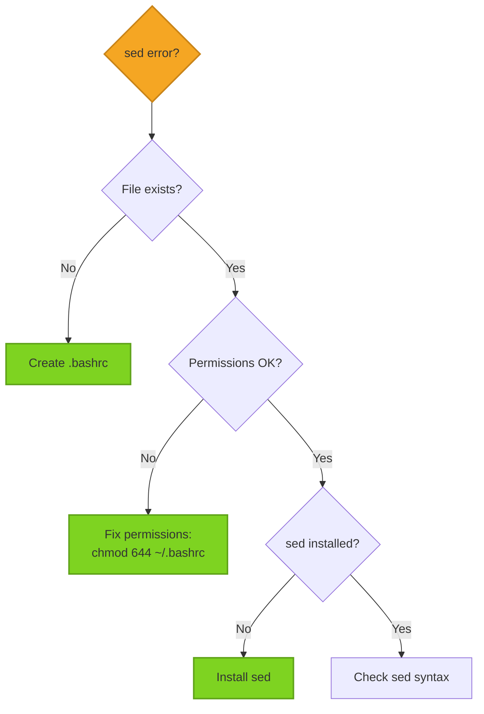
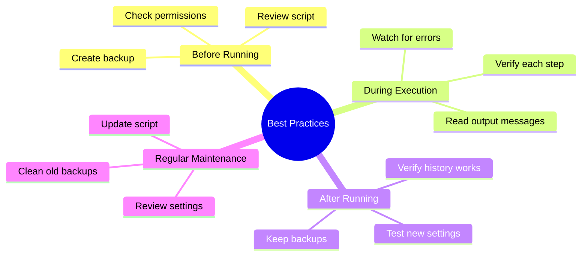

# Troubleshooting Guide

## Common Issues and Solutions



## Issue 1: ~/.bashrc File Not Found

### Symptoms
```
~/.bashrc file not found
```

### Diagnosis
```bash
ls -la ~/.bashrc
```

### Solution


**Steps:**
1. Check if file exists:
   ```bash
   ls -la ~/.bashrc
   ```

2. If missing, create from template:
   ```bash
   cp /etc/skel/.bashrc ~/.bashrc
   ```

3. Or create a basic one:
   ```bash
   cat > ~/.bashrc << 'EOF'
   # Basic .bashrc
   HISTSIZE=1000
   HISTFILESIZE=2000
   EOF
   ```

4. Run histmod.sh again

## Issue 2: Permission Denied

### Symptoms
```
bash: ./histmod.sh: Permission denied
```

### Diagnosis
```bash
ls -l histmod.sh
```

### Solution

```bash
# Make the script executable
chmod +x histmod.sh

# Verify permissions
ls -l histmod.sh
# Should show: -rwxr-xr-x
```

## Issue 3: Changes Not Applied

### Symptoms
- Script runs successfully
- But HISTSIZE still shows old value

### Diagnosis Flow



### Solution

1. Check if changes were written:
   ```bash
   grep -E "HISTSIZE|HISTFILESIZE" ~/.bashrc
   ```

2. Reload the configuration:
   ```bash
   source ~/.bashrc
   ```

3. Verify in current session:
   ```bash
   echo $HISTSIZE
   echo $HISTFILESIZE
   ```

4. If still not working, open a new terminal

## Issue 4: Script Runs But Values Unchanged

### Symptoms
- No error messages
- File modification timestamp doesn't change
- Values remain the same

### Diagnosis



### Solution

1. Check for commented lines:
   ```bash
   grep "^#.*HISTSIZE" ~/.bashrc
   ```

2. If found, uncomment them first:
   ```bash
   sed -i 's/^#\s*HISTSIZE/HISTSIZE/' ~/.bashrc
   sed -i 's/^#\s*HISTFILESIZE/HISTFILESIZE/' ~/.bashrc
   ```

3. Run histmod.sh again

## Issue 5: Backup/Restore Problems

### Creating Manual Backup

```bash
# Create backup directory
mkdir -p ~/.config_backups

# Create timestamped backup
cp ~/.bashrc ~/.config_backups/bashrc_$(date +%Y%m%d_%H%M%S)

# Verify backup
ls -lh ~/.config_backups/
```

### Restoring from Backup



```bash
# List available backups
ls -lh ~/.config_backups/

# Restore specific backup
cp ~/.config_backups/bashrc_YYYYMMDD_HHMMSS ~/.bashrc

# Reload
source ~/.bashrc
```

## Issue 6: sed Command Errors

### Symptoms
```
sed: can't read ~/.bashrc: No such file or directory
```

### Solution Decision Tree



## Issue 7: History Not Persisting

### Symptoms
- Script runs successfully
- Settings applied correctly
- But history still clears between sessions

### Diagnosis

```bash
# Check if history is being saved
echo $HISTFILE
# Should show: /home/username/.bash_history

# Check if history file exists and is writable
ls -l ~/.bash_history

# Check for HISTCONTROL settings
grep HISTCONTROL ~/.bashrc
```

### Solution

1. Ensure HISTFILE is set:
   ```bash
   echo 'export HISTFILE=~/.bash_history' >> ~/.bashrc
   ```

2. Check for ignorespace/ignoredups:
   ```bash
   # These settings might be preventing history saving
   grep "HISTCONTROL=ignorespace" ~/.bashrc
   ```

3. Reload and test:
   ```bash
   source ~/.bashrc
   history -a  # Append current session to history file
   ```

## Diagnostic Commands

### Full System Check

```bash
#!/bin/bash
echo "=== GPT Shell Diagnostic Report ==="
echo ""
echo "1. Bash version:"
bash --version | head -1
echo ""
echo "2. .bashrc status:"
ls -lh ~/.bashrc
echo ""
echo "3. Current HIST settings:"
echo "HISTSIZE=$HISTSIZE"
echo "HISTFILESIZE=$HISTFILESIZE"
echo ""
echo "4. .bashrc HIST settings:"
grep -E "^HISTSIZE|^HISTFILESIZE" ~/.bashrc
echo ""
echo "5. History file:"
ls -lh ~/.bash_history
echo ""
echo "6. histmod.sh status:"
ls -l histmod.sh
echo ""
echo "7. Recent history count:"
history | wc -l
echo ""
```

## Getting Help

If issues persist:


1. Review this troubleshooting guide
2. Check [GitHub Issues](https://github.com/danindiana/gpt_shell/issues)
3. Create a new issue with:
   - Your OS and bash version
   - Output from diagnostic commands
   - Exact error messages
   - Steps you've already tried

## Prevention Tips



1. Always backup before running scripts
2. Test in a non-critical environment first
3. Keep multiple backup versions
4. Document any custom modifications
5. Regularly verify your settings
