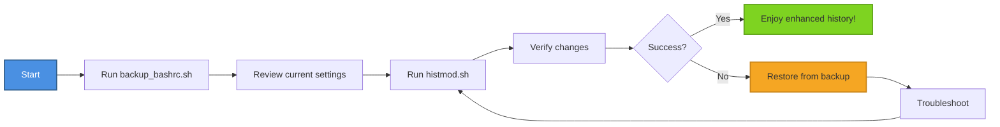

# Examples Directory

This directory contains example scripts and usage demonstrations for the GPT Shell project.

## Files

### usage_example.sh
A comprehensive walkthrough of how to use `histmod.sh`, including:
- Basic usage examples
- How to check current settings
- How to verify changes
- How to utilize the enhanced history features

### backup_bashrc.sh
A safety-first backup script that:
- Creates timestamped backups of your `.bashrc` file
- Stores backups in `~/.config_backups/`
- Provides restore commands
- Lists all available backups

## Running the Examples

```bash
# Make scripts executable
chmod +x examples/*.sh

# View usage examples
./examples/usage_example.sh

# Create a backup before running histmod.sh
./examples/backup_bashrc.sh

# Then run the main script safely
./histmod.sh
```

## Best Practices

1. Always create a backup before modifying configuration files
2. Review the script output to ensure changes were applied
3. Test in a non-production environment first
4. Keep multiple backup versions for safety

## Workflow Diagram


